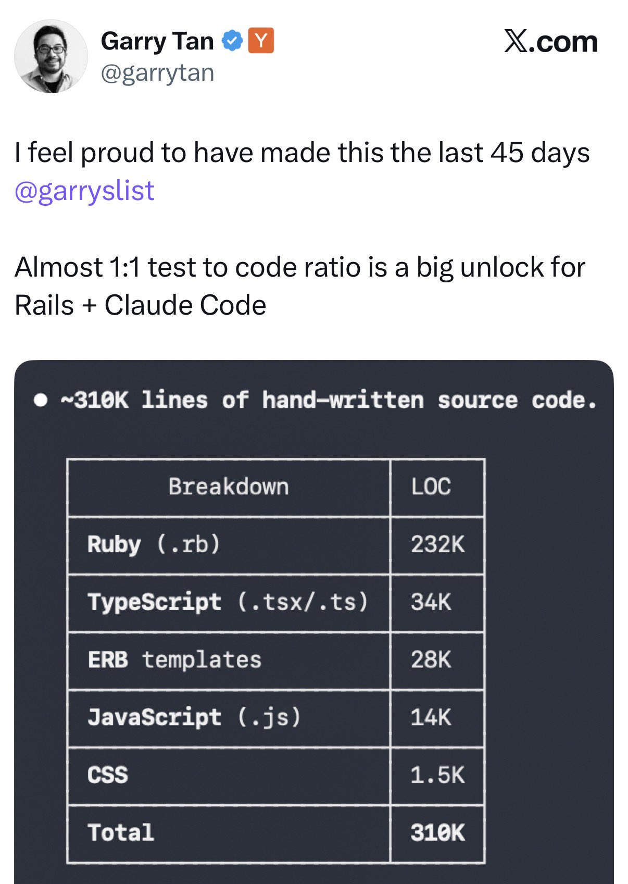

# Garry's Count

> Ever wonder if you are shipping at YC speed? 
>
> **Until now.**



Garry's Count is a Claude Code plugin that tracks how many lines of code Claude writes per day and displays a running total in your status bar.

```
Garry's Count: 4,207 lines of hand-written source code
```

## Install

```bash
git clone https://github.com/markrabey/garryscount.git && cd garryscount && bash install.sh
```

Restart Claude Code. Start coding. Watch the number go up.

## How it works

A PostToolUse hook fires every time Claude writes or edits a file. It counts the lines and adds them to a daily tally stored at `~/.claude/garryscount/`. A status line script reads the tally and shows it in the status bar.

The daily count resets at **5am** (configurable), because devs don't stop at midnight.

## Report command

Type `/garryscount` in Claude Code to get a Garry-style breakdown report:

- Lines of code by file type, just like the tweet
- Last 7 days of daily totals
- Shipping speed label if you have a full week of data (100k+ lines = "Shipping at YC speed")

## Configuration

Edit `~/.claude/garryscount/config.json`:

```json
{
  "reset_hour": 5,
  "count_mode": "default",
  "label": "lines of hand-written source code"
}
```

### Counting modes

| Mode | Description |
|------|-------------|
| `"default"` | **(default)** Net new lines only. For edits, subtracts old lines from new. |
| `"yc-mode"` | Every line Claude writes counts, even if it rewrites the same file. Overcounting is a feature. |

### Label

The text shown after the number in the status bar. Default is `"lines of hand-written source code"`. Set to `"loc"` if you want it short.

### Reset hour

The hour (0-23) when the daily count resets. Default is `5` (5am). Set to `0` for midnight reset.

## Color coding

The status bar changes color as Claude's daily output grows:

- **Green** — under 1,000 lines (warming up)
- **Yellow** — 1,000-5,000 lines (cooking)
- **Red** — 5,000-10,000 lines (on fire)
- **Magenta** — 10,000+ lines (legendary)

## Uninstall

```bash
cd garryscount && bash uninstall.sh
```

## Requirements

- [Claude Code](https://claude.ai/code)
- `jq` (`brew install jq` on macOS)

## Plugin mode

You can also load it as a Claude Code plugin (hooks only, no status line):

```bash
claude --plugin-dir /path/to/garryscount
```

For the status line, run `install.sh` or manually add to `~/.claude/settings.json`:

```json
{
  "statusLine": {
    "command": "~/.claude/garryscount/statusline.sh"
  }
}
```

## License

MIT
